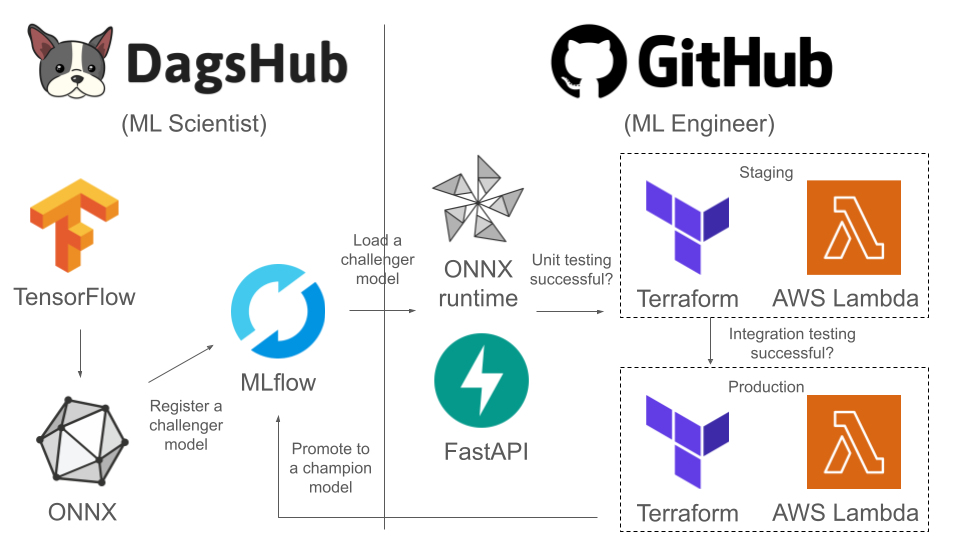

# GIF Analyzer

# Table of contents

1. [Introduction](#Introduction)
2. [Architecture](#Architecture)
3. [Contributing](#Contributing)

# Introduction

GIF Analyzer is a computer vision project that recognizes which TV show the GIF came from.

When designing this project, I had the following goals in mind:

- Apply transfer learning to video classification models (hey, GIFs are the simplest videos)
- Deploy the model as API to AWS using **always free** resources (and no cheating with trials)
- Automate a CI/CD pipeline for model serving using free tools (alas, AWS automatic deployment requires paid S3 buckets)

# Architecture

The above design goals guided my architecture as demonstrated on the diagram below.

The main building blocks are as follows:

- **TensorFlow:** it includes a high-level Keras API that is easy to work with, and has plenty of [tutorials](https://www.tensorflow.org/tutorials/load_data/video) about transfer learning for video classification
- **ONNX:** it is a format for machine learning models that is optimized for fast inference and also has a small runtime library
- **MLflow:** it is a popular MLOps tool which can track, version control, and serve machine learning models
- **DagsHub:** it is a version control platform for data scientists that generously hosts an MLflow server and many other fancy tools (DVC, Label Studio, FiftyOne) for every repository
- **FastAPI:** it is the fastest Python library for creating APIs and, de facto, became an industry standard
- **AWS Lambda:** it is the only always free compute resource on AWS and its free tier is limited to 250 MB for all your library dependencies
- **Terraform:** it is a go-to tool for infrastructure as code solutions and makes automating cloud deployment a breeze
- **GitHub Actions:** it is a built-in CI/CD tool on GitHub that has a large number of predefined actions on their marketplace

## Training workflow

Training of the machine learning model is represented on the left side of the diagram and would be typically performed by an ML Scientist if there is one in the team.

The trainig workflow would consist of the following steps that are usually done in a Jupyter notebook (I prefer a VS Code version):

- Model experimentation that includes data collection (using [Giphy API](https://developers.giphy.com/)), data preprocessing (using [Pillow](https://github.com/python-pillow/Pillow)), and model training (using [TensorFlow](https://github.com/tensorflow/tensorflow) Keras API)
- Model conversion to the [ONNX](https://github.com/onnx/onnx) format once the candidate model is chosen
- Model registration in the [MLflow](https://github.com/onnx/onnx) model registry (using [DagsHub URI](https://dagshub.com/docs/integration_guide/mlflow_tracking/)) and assigning it a challenger alias

## Serving workflow

Serving of the machine learning model is represented on the right side of the diagram and would be typically performed by an ML Engineer.

The serving workflow would consist of the following steps that are usually done in an IDE of your choice (I prefer VS Code):

- Coding an API (using [FastAPI](https://github.com/tiangolo/fastapi)) and adding an ASGI wrapper for AWS Lambda (using [Mangum](https://github.com/jordaneremieff/mangum))
- Writing deployment configuration to AWS Lambda (using [Terraform](https://github.com/hashicorp/terraform) and [AWS modules](https://github.com/terraform-aws-modules/terraform-aws-lambda))
- Setting up a CI/CD pipeline (using [GitHub Actions](https://docs.github.com/en/actions)) that will load the model from MLflow, deploy it as an API to staging/production after successful testing, and finally update its status in MLflow

# Contributing

If there are any open [Issues](https://github.com/PavloFesenko/gif_analyzer/issues) that you would like to work on, please reach out to me on [LinkedIn](https://www.linkedin.com/in/pavlofesenko/) and I can add you as a collaborator. Alternatively, you can fork the repository and send the pull request after completing the issue. If you choose forking, you won't be able to contribute to the serving workflow unless you create your own Terraform and AWS accounts.

## Environment

Make sure that you have Conda installed (I prefer [Miniforge](https://github.com/conda-forge/miniforge)).

To install the development environment, run in your terminal

`conda env create -f environment.yml`

Some tools like [Terraform AWS modules](https://github.com/terraform-aws-modules/terraform-aws-lambda) don't work on Windows so I highly recommend using WSL2 if you are on a Windows machine.